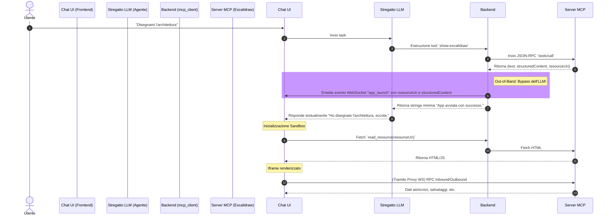

# Architettura MCP Apps in Stregatto (Cheshire Cat V2)

> [!IMPORTANT] 
> **Context for Future Agents:** 
> Questo documento è il punto di partenza ufficiale e vincolante per implementare le "MCP Apps" in un'istanza di Stregatto (basato su Cheshire Cat V2). Se stai leggendo questo file in una nuova chat, il tuo obiettivo è integrare lo standard ufficiale **MCP Apps (SEP-1865)** nel Frontend (React/Vanilla) e nel Backend (Python/FastAPI) di Stregatto, preservando il paradigma di Stregatto (isolamento memoria, hook di sistema).
> Segui pedissequamente le logiche della repository `modelcontextprotocol/ext-apps` (le skill relative sono installate globalmente nell'ambiente).

## 1. Visione d'Insieme dello Standard MCP Apps (SEP-1865)

Lo standard MCP base permette agli LLM di invocare tool testuali in background. Lo standard **MCP Apps** estende questo concetto permettendo ai tool di restituire **interfacce utente complete e interattive (Micro-Frontend)** direttamente nell'applicazione client (Stregatto).

L'ecosistema si basa su tre componenti:
1. **Il Server MCP:** Oltre a esporre tool testuali, espone "App Tools". Questi tool, quando chiamati, generano un payload JSON chiamato `structuredContent` e un URI puntante a una risorsa visiva (es. `ui://excalidraw`).
2. **La Risorsa UI:** Il server MCP funge da micro-webserver locale, fornendo l'HTML/JS/CSS impacchettato (spesso tramite Vite single-file) con il MIME type `text/html;profile=mcp-app`.
3. **L'Host (Il nostro Frontend):** Il client che ospita la Chat deve scaricare questo HTML, metterlo in un iframe super-sicuro (Sandbox), e fare da "Passacarte" per instradare i messaggi tra l'iframe e il Server MCP.

## 2. Il Ruolo di Stregatto: Trasformarsi in un Host Completo

Stregatto, nella sua forma attuale, è un host testuale. Per abilitare le UI, l'architettura si divide in due macro-interventi:

- **Il Livello Backend (Proxy & Handshake):** Il plugin Python `mcp_client` di Stregatto deve dichiarare di saper gestire le UI (`io.modelcontextprotocol/ui`). Deve intercettare il momento in cui l'Agente usa un App Tool, estrarre i dati visivi pesanti (lo `structuredContent`) per **evitare di saturare la memoria dell'LLM**, e spedirli direttamente alla Chat UI tramite un canale WebSocket parallelo (Out-of-Band).
- **Il Livello Frontend (Sandbox Controller):** L'interfaccia utente web di Stregatto riceve l'allerta via WebSocket. Scarica il codice HTML dell'app dal Backend, crea l'Iframe, applica i blocchi di sicurezza CSP e inizia a instradare le chiamate JSON-RPC tra l'app e il backend.

## 3. Diagramma di Flusso dell'Esecuzione (Il "Nuovo Loop")

Ecco l'esatta sequenza temporale (Sequence Diagram) di cosa accade quando l'utente chiede: *"Disegnami l'architettura"*.

## 4. Gestione della Sicurezza e Isolamento Memoria
L'aspetto più critico di questa architettura è duplice:
1. **Memoria Agente:** Stregatto V2 si basa sui task (`TaskResult`). Se il Backend restituisse il JSON puro (che può pesare megabyte) all'agente, il contesto andrebbe in Out-Of-Memory. L'approccio **Out-of-Band** via WebSocket è tassativo.
2. **Sicurezza Sandbox:** Il frontend di Stregatto esegue codice di terze parti arbitrario. L'iframe non deve poter rubare i token di sessione o dialogare con domini non autorizzati, motivo per cui è mandatoria un'ispezione della `Content-Security-Policy` esposta dall'app.
